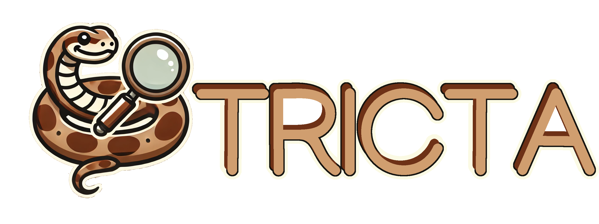

<p  align="center">
  
</p>

# STRICTA: Structure Reasoning in Critical Text Asssessment

[](https://arxiv.org/pdf/2409.05367)
[](https://opensource.org/licenses/Apache-2.0)
[](https://www.python.org/)
[](https://github.com/UKPLab/acl2025-stricta/actions/workflows/main.yml)

> **Abstract:** Critical text assessment is at the core of many expert activities, such as fact-checking, peer review,
> and essay grading. Yet, existing work treats critical text assessment as a black box problem, limiting interpretability
> and human-AI collaboration. To close this gap, we introduce Structured Reasoning In Critical Text Assessment (STRICTA),
> a novel specification framework to model text assessment as an explicit, step-wise reasoning process. STRICTA breaks
> down the assessment into a graph of interconnected reasoning steps drawing on causality theory (Pearl, 1995). This graph
> is populated based on expert interaction data and used to study the assessment process and facilitate human-AI
> collaboration. We formally define STRICTA and apply it in a study on biomedical paper assessment, resulting in a dataset
> of over 4000 reasoning steps from roughly 40 biomedical experts on more than 20 papers. We use this dataset to
> empiricallystudy expert reasoning in critical text assessment, and investigate if LLMs are able to imitate and support
> experts within these workflows. The resulting tools and datasets pave the way for studying collaborative expert-AI
> reasoning in text assessment, in peer review and beyond.

You can find the experimental code for the average causal effect estimation and counterfactual analysis, as well as 
the LLM experiments for biomedical paper assessment in this repository.

> Contact person: [Nils Dycke](https://www.informatik.tu-darmstadt.de/ukp/ukp_home/staff_ukp/ukp_home_content_staff_1_details_109248.en.jsp)

[UKP Lab](https://www.ukp.tu-darmstadt.de/) | [TU Darmstadt](https://www.tu-darmstadt.de/)

Don't hesitate to send us an e-mail or report an issue, if something is broken (and it shouldn't be) or if you have
further questions.

## Getting Started

### Quickstart

1. Install the package

```
pip install git+https://github.com/UKPLab/acl2025-stricta
```

2. Download Dataset

Download the data from [tudatalib](https://tudatalib.ulb.tu-darmstadt.de/handle/tudatalib/4614); you need to request
access and will receive a personalized link for download. Unpack the dataset into a directory `./data`

## Dataset Structure

The downloaded dataset follows the below structure. We provide easy methods for loading the dataset. Decide up-front
if you want to use the raw data or the annotations with language error correction (typos, capitalization, ...). Then
pass one of the two directories to the loading functions below. Check out the README.md in the `data` directory for
more details on the dataset structure.

## Usage


### Checkout the Dataset

Load the STRICTA workflow and data for biomedical paper assessment:

```python
from acl2025_stricta.base import load, load_itemwise_dataset

# for data inspection
workflow_main, papers_main, annotations_main = load("./data/annotations_language_corrected/main_study")
workflow_students, papers_students, annotations_students = load("./data/annotations_language_corrected/student_seminar")

workflow = workflow_main
papers = {**{f"main_{k}" for k,v in papers_main.items()}, **{f"students_{k}" for k,v in papers_students.items()}}
annotations = {**{f"main_{k}" for k,v in annotations_main.items()}, **{f"students_{k}" for k,v in annotations_students.items()}}

# for running experiments
itemwise_workflow, itemwise_papers, itemwise_annotations = load_itemwise_dataset([
    "./data/annotations_language_corrected/main_study",
    "./data/annotations_language_corrected/student_seminar"
    ]
)
```

### Inspect the workflow

Run following code based on the loaded workflow and annotations; check out the result produced under `./visualizations`.

```python
from acl2025_stricta.base import WorkflowVisualization
import os

os.mkdirs("./visualizations", exist_ok=True)
vis = WorkflowVisualization(workflow, annotations, "./visualizations")

vis.show_graphviz()
```

### Iterate the data

```python
for paper_id in papers:
    paper = papers[paper_id]
    annotated_workflow = annotations[paper_id]

    for aid, exec in annotated_workflow.items():
        print(f"Paper: {paper_id}, Annotation ID: {aid}")
        for wi in workflow:
            if wi in exec:
                print(f"  Step: {wi}, Content: {exec[wi]}")
            else:
                print(f"  Step: {wi} not executed")
```

### Running workflow with LLMs

Instantiate using an LLM of your choice:

```python
# e.g. llama-3
from acl2025_stricta.moels import LlamaWorkflow
from acl2025_stricta.eval import predict_itemwise, store_predictions

local_model_path = "<path to local model weights>"
model_subpath = "depends on the number of params etc. e.g. '8B-Instruct'"
with open("./prompts/llama3/extract.txt", "r") as f:
    exprompt = f.read().strip()
with open("./prompts/llama3/infer.txt", "r") as f:
    infprompt = f.read().strip()

llama3 = LlamaWorkflow(workflow,
                       "llama-3",
                       model_path=local_model_path,
                       model_subpath=model_subpath,
                       compress_paper=True) # discards references of paper to reduce context usage
llama3.set_instructions(exprompt, "extract")
llama3.set_instructions(infprompt, "infer")

os.mkdir("./results", exist_ok=True)
predictions = predict_itemwise(
    workflow=itemwise_workflow,
    papers=itemwise_papers,
    annotations=itemwise_annotations,
    model=llama3,
    _cache_dir="./results"
)

store_predictions(predictions, "./results/predictions.csv")
```

### SCM 
You can fit the SCM and run analysis:

```python
from acl2025_stricta.eval import fit_boolean_scm

scm = fit_boolean_scm(
    dataset_paths=[
        "./data/raw/main_study",
        "./data/raw/student_seminar"
    ],
)

average_treatment_effect = average_treatment_effect(
    scm = scm,
    intervention=dict(step004_8=lambda x: True),
    not_intervention=dict(step004_8=lambda x:False)
)

print(f"Averaged treatment effect of step004_8: {average_treatment_effect}")

some_factual = annotations["main_paper_2"][4]

counterfactual = counterfactual(
    scm=scm,
    sample = some_factual,
    intervention = dict(step004_8=lambda x: False)
)
print(f"Counterfactual on step004_8 for final node: {counterfactual}")
```

### CLI for paper experiments

This is how you can use `acl2025_stricta` from command line:

```bash
MODEL_PATH="<dataset_path to your local model weights>"
MODEL_SUBPATH="8b-Instruct"


$ python -m acl2025_stricta --dataset_path "./data/annotations_language_corrected" \
    --experiment predict \
    --model-name llama-3 
    
$ python -m acl2025_stricta --dataset_path "./data/annotations_language_corrected" \
--experiment eval \
--model-name llama-3 
```

In the `./results` directory you will find the predictions in `predictions.csv` for the selected model plus
an eval directory for the model with the scores for the predictions.


## Cite

Please use the following citation:

```
@misc{dycke2025strictastructuredreasoningcritical,
      title={STRICTA: Structured Reasoning in Critical Text Assessment for Peer Review and Beyond}, 
      author={Nils Dycke and Matej Zečević and Ilia Kuznetsov and Beatrix Suess and Kristian Kersting and Iryna Gurevych},
      year={2025},
      eprint={2409.05367},
      archivePrefix={arXiv},
      primaryClass={cs.CL},
      url={https://arxiv.org/abs/2409.05367}, 
}
```

## Disclaimer

> This repository contains experimental software and is published for the sole purpose of giving additional background
> details on the respective publication.